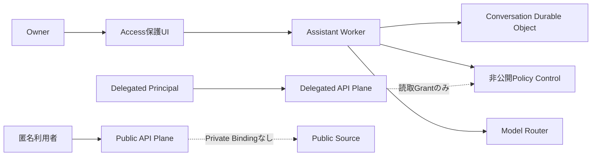

# Open Personal Agent Platform

[English](README.md)

Open Personal Agent Platformは、Cloudflareを常時稼働する制御基盤として使う、本人専用のオープンソース・パーソナルエージェント基盤です。

一つの配置は、一人のOwnerだけに属します。
外部サイトの利用者はDelegated Principalとして分離され、Ownerの個人秘書を共同利用しません。

> [!WARNING]
> 現在のリリースは`v0.1.0-alpha.1`です。
> Phase 3のConnector実装をstagingで段階的に検証している段階であり、本番SLAと長期API互換性は提供していません。

## 現在利用できる機能

- Cloudflare Access JWTを再検証するOwner専用Web UI
- Conversation、Task、Structured Memory、Approval、Audit
- D1、SQLite-backed Durable Objects、Service BindingによるPrivate Control Plane
- OwnerとDelegated Principalを分離するIdentityとACL
- Information Policy、Capability、Execution Lease、Provenance、Audit Hash Chain
- 非AI資源のReservationと包含量80%の既定Hard Limit
- Workers AIの月5 USD超過予算、AI Gateway、Neuron Reservation
- Mock Local ProviderとWorkers AI Provider
- AI Gateway経由の`@cf/google/gemma-4-26b-a4b-it`
- Public WorkerからPrivate Bindingを排除するCI契約試験
- Cloudflare契約や実資格情報を必要としないContributor CI
- 日本語と英語のUI、設定を保持するライトテーマとダークテーマ
- Gmail、Calendar、Driveを扱うGoogle Personal Connector
- Repository読取、承認付きIssue作成、承認付きComment投稿を行うGitHub App Connector
- DiscordのSlash Command、Owner Link、Task Scheduling、Approval、通知、実験的DM Gateway Bridge
- CredentialとResource Allowlistを分離した読取専用Delegated Source Gatekeeper

Ownerは招待や他者の承認なしで初回設定を開始します。
Delegated Principalは明示的に公開されたSourceだけを読み取れます。

## 未実装の機能

公開Knowledge API、Delegated SourceのQuery接続、MCP、生成SDK、動的Sandbox Pluginは後続Phaseで実装します。
GitHubコード変更、決済、複数Owner、複数Tenantはv0.1の対象外です。
Gmail送信は、正確な内容をOwnerが承認した場合に限り利用できます。

## セキュリティ境界



Public WorkerはControl D1、OAuth Gatekeeper、Owner Memory、Private R2、Local Providerへ到達できません。
Ownerデータは送信先が明示的に許可された場合だけCloud Providerへ送信され、`secret`データはすべてのModel利用を拒否します。

## 開発

Node.js 24とpnpm 10が必要です。

```bash
pnpm install --frozen-lockfile
pnpm check
```

`pnpm check`はLint、strict TypeScript、TestとCoverage基準、全Workerのdry-run buildを実行します。
通常のCIはMockだけを使います。

## 配置

標準配置先はCloudflare Workers Paidです。
配置固有のResource ID、Owner Email、Access Audience、Gateway IDは、Gitが無視する`.wrangler/`配下の生成ファイルへ設定します。

現在の手順は[Phase 2 stagingガイド](docs/ja/operations/phase-2-staging.md)を参照してください。
コード変更不要のCloud Base Profileと完全な導入Wizardはv0.1で整備します。

## 費用とプライバシー

- 非AI資源は包含量の60%で警告し、80%で既定停止します。
- Workers AIは日次無料Neuronを先に使い、月5 USDまでの超過を既定で許可します。
- AI GatewayのSpend Limitを二次防壁として使います。
- Gateway Payload Loggingは無効です。
- AI予算到達後も、Modelを使わない検索は継続します。
- 無許可のCloud Providerへ自動Fallbackしません。
- 外部Telemetryは既定で無効です。

アプリケーションのHard Limitは、Workerコード実行前に計上される要求と、同じCloudflareアカウント内にある別Workerの利用量を制御できません。
詳細は[利用量と費用予算](docs/ja/operations/resource-budgets.md)を参照してください。

## 文書

- [アーキテクチャ](docs/ja/architecture/overview.md)
- [脅威モデル](docs/ja/security/threat-model.md)
- [データ処理方針](docs/ja/security/data-handling.md)
- [Identity設定](docs/ja/operations/identity-configuration.md)
- [Owner操作面](docs/ja/operations/owner-surface.md)
- [Phase 3 Connector](docs/ja/operations/phase-3-connectors.md)
- [Google・GitHub Provider設定](docs/ja/operations/connector-provider-setup.md)
- [多言語対応](docs/ja/contributing/localization.md)

## セキュリティとライセンス

脆弱性は公開Issueではなく、非公開のGitHub Security Advisoryから報告してください。
[SECURITY.ja.md](SECURITY.ja.md)を参照してください。

Apache License 2.0
