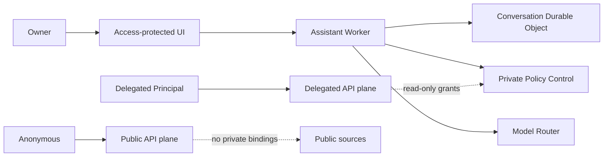

# Open Personal Agent Platform

[日本語](README.ja.md)

Open Personal Agent Platform is a single-owner, open-source personal agent platform that uses Cloudflare as its always-on control plane.

Each deployment belongs to one owner.
External users are isolated as delegated API principals and never become co-users of the owner's personal assistant.

> [!WARNING]
> The current development line targets `v0.1.0-beta.1`.
> Cloud Base is beta; Dynamic Plugins, Sandbox Preview, and the Docker Discord Gateway Bridge remain experimental.

## Available now

- An owner-only web UI that revalidates Cloudflare Access JWTs
- Conversation, task, structured memory, approval, and audit surfaces
- Private control plane using D1, SQLite-backed Durable Objects, and Service Bindings
- Identity and ACL separation between the owner and delegated principals
- Information policies, capabilities, execution leases, provenance, and an audit hash chain
- Non-AI reservations with an 80% default hard limit against included usage
- A USD 5 monthly Workers AI overage budget, AI Gateway, and neuron reservations
- Mock Local Provider and Workers AI Provider
- `@cf/google/gemma-4-26b-a4b-it` through AI Gateway
- CI contract tests that prevent private bindings on the Public Worker
- Contributor CI that requires neither a Cloudflare account nor real credentials
- Japanese and English UI, with persistent light and dark themes
- Google Personal Connector for Gmail, Calendar, and Drive
- GitHub App connector for repository reads, approved Issue creation, and approved comments
- Discord slash commands, owner linking, task scheduling, approvals, notifications, and an experimental DM Gateway Bridge
- Separate read-only Delegated Source Gatekeeper credentials and resource allowlists
- Public and delegated `POST /v1/query` APIs with model-free search and cited answers
- Fixture, static-index, AI Search, Google Drive, and GitHub knowledge adapters
- OpenAPI 3.1 documents, the typed `@opap/sdk`, and stateless Streamable HTTP MCP
- An actual `okidev-web` AI Search binding, plus a staging-only public-endpoint compatibility transport
- Conversation Registry, owner export, deletion propagation, daily audit checkpoints, and retention jobs
- Build-time Static Plugin registry and an owner-only Dynamic Plugin inspection/runtime path
- `local-dev`, `minimal`, `cloud-base`, and experimental `cloud-base-dynamic` deployment profiles
- Cross-platform Docker Compose packaging for the experimental Discord Gateway Bridge

The owner starts setup without an invitation or approval from another person.
Delegated principals may only read sources explicitly published to them.

## Scope limits

GitHub code changes, payments, multiple owners, and multi-tenancy are outside the v0.1 scope.
Gmail sending is available only through an exact-content owner approval.
The Local AI Router, public Plugin registry, and arbitrary Plugin internet access are not included in beta.1.

## Security boundaries



The Public Worker cannot reach Control D1, OAuth gatekeepers, owner memory, Private R2, or a Local Provider.
Owner data is sent to a cloud provider only when the destination is explicitly permitted, and `secret` data is denied to every model.

## Development

Node.js 24 and pnpm 11 are required.

```bash
pnpm install --frozen-lockfile
pnpm check
```

`pnpm check` runs linting, strict TypeScript checks, tests and coverage thresholds, and dry-run builds for every Worker.
The normal CI path uses mocks only.

## Deployment

The standard deployment target is Cloudflare Workers Paid.
Deployment-specific resource IDs, owner email, Access audience, and Gateway ID belong in generated files under `.wrangler/`, which Git ignores.

Run `pnpm opap setup --profile cloud-base` to review the deployment plan and preflight checks.
After review, add `--apply` to provision or reuse D1 and R2, back up existing D1 data, apply migrations, register configured secrets, deploy, and run deployment-status checks.

For the guided installer, use `./install.ps1` on Windows or `sh ./install.sh` on macOS and Linux. Add `--apply` only when you are ready to change the selected Cloudflare account.
Add `--apply` only after resource IDs, secrets, and the migration backup have been reviewed.
The setup command never changes an existing Access team domain, Tunnel, application, or policy.

## Cost and privacy

- Non-AI resources warn at 60% and stop by default at 80% of included usage.
- Workers AI consumes the daily free neuron allowance first, then permits up to USD 5 of monthly overage by default.
- AI Gateway Spend Limits provide a secondary guard.
- Gateway payload logging is disabled.
- Model-free search continues after the AI budget is exhausted.
- The system never falls back to an unauthorized cloud provider.
- External telemetry is off by default.

Application hard limits cannot guarantee the total Cloudflare account bill because requests are metered before Worker code runs and other Workers in the account may consume the same allowance.
See [resource budgets](docs/en/operations/resource-budgets.md).

## Documentation

- [Auditing the OPAP Setup Wizard](docs/en/operations/installer-security.md)

- [Architecture](docs/en/architecture/overview.md)
- [Threat model](docs/en/security/threat-model.md)
- [Data handling](docs/en/security/data-handling.md)
- [Identity configuration](docs/en/operations/identity-configuration.md)
- [Owner surface](docs/en/operations/owner-surface.md)
- [Phase 3 connectors](docs/en/operations/phase-3-connectors.md)
- [Phase 4 knowledge APIs](docs/en/operations/phase-4-knowledge.md)
- [Google and GitHub provider setup](docs/en/operations/connector-provider-setup.md)
- [Phase 5 operations and plugins](docs/en/operations/phase-5-beta.md)
- [Localization](docs/en/contributing/localization.md)

## Security and license

Report vulnerabilities through a private GitHub Security Advisory, not a public issue.
See [SECURITY.md](SECURITY.md).

Apache License 2.0
