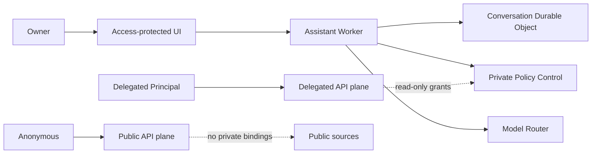

# Open Personal Agent Platform

[日本語](README.ja.md)

Open Personal Agent Platform is a single-owner, open-source personal agent platform that uses Cloudflare as its always-on control plane.

Each deployment belongs to one owner.
External users are isolated as delegated API principals and never become co-users of the owner's personal assistant.

> [!WARNING]
> The current release is `v0.1.0-alpha`.
> It contains the Phase 2 vertical slice validated in staging, without a production SLA or long-term API compatibility guarantee.

## Available now

- An owner-only web UI that revalidates Cloudflare Access JWTs
- Conversation, task, structured memory, approval, and audit surfaces
- Private control plane using D1, SQLite-backed Durable Objects, and Service Bindings
- Identity and ACL separation between the owner and delegated principals
- Information policies, capabilities, execution leases, provenance, and an audit hash chain
- Non-AI reservations with an 80% default hard limit against included usage
- A USD 5 monthly Workers AI overage budget, AI Gateway, and neuron reservations
- Mock Local Provider and Workers AI Provider
- `@cf/google/gemma-4-26b-a4b-it` through AI Gateway
- CI contract tests that prevent private bindings on the Public Worker
- Contributor CI that requires neither a Cloudflare account nor real credentials
- Japanese and English UI, with persistent light and dark themes

The owner starts setup without an invitation or approval from another person.
Delegated principals may only read sources explicitly published to them.

## Not implemented yet

The Google Personal Connector is available.
The GitHub Personal Connector is implemented and awaiting staging GitHub App configuration.
Discord, the public Knowledge API, MCP, the generated SDK, and dynamic Sandbox plugins remain in later phases.
GitHub code changes, payments, multiple owners, and multi-tenancy are outside the v0.1 scope.
Gmail sending is available only through an exact-content owner approval.

## Security boundaries



The Public Worker cannot reach Control D1, OAuth gatekeepers, owner memory, Private R2, or a Local Provider.
Owner data is sent to a cloud provider only when the destination is explicitly permitted, and `secret` data is denied to every model.

## Development

Node.js 24 and pnpm 10 are required.

```bash
pnpm install --frozen-lockfile
pnpm check
```

`pnpm check` runs linting, strict TypeScript checks, tests and coverage thresholds, and dry-run builds for every Worker.
The normal CI path uses mocks only.

## Deployment

The standard deployment target is Cloudflare Workers Paid.
Deployment-specific resource IDs, owner email, Access audience, and Gateway ID belong in generated files under `.wrangler/`, which Git ignores.

See the [Phase 2 staging guide](docs/en/operations/phase-2-staging.md) for the current procedure.
The code-free Cloud Base profile and complete setup wizard remain v0.1 work.

## Cost and privacy

- Non-AI resources warn at 60% and stop by default at 80% of included usage.
- Workers AI consumes the daily free neuron allowance first, then permits up to USD 5 of monthly overage by default.
- AI Gateway Spend Limits provide a secondary guard.
- Gateway payload logging is disabled.
- Model-free search continues after the AI budget is exhausted.
- The system never falls back to an unauthorized cloud provider.
- External telemetry is off by default.

Application hard limits cannot guarantee the total Cloudflare account bill because requests are metered before Worker code runs and other Workers in the account may consume the same allowance.
See [resource budgets](docs/en/operations/resource-budgets.md).

## Documentation

- [Architecture](docs/en/architecture/overview.md)
- [Threat model](docs/en/security/threat-model.md)
- [Data handling](docs/en/security/data-handling.md)
- [Identity configuration](docs/en/operations/identity-configuration.md)
- [Owner surface](docs/en/operations/owner-surface.md)
- [Phase 3 connectors](docs/en/operations/phase-3-connectors.md)
- [Google and GitHub provider setup](docs/en/operations/connector-provider-setup.md)
- [Localization](docs/en/contributing/localization.md)

## Security and license

Report vulnerabilities through a private GitHub Security Advisory, not a public issue.
See [SECURITY.md](SECURITY.md).

Apache License 2.0
