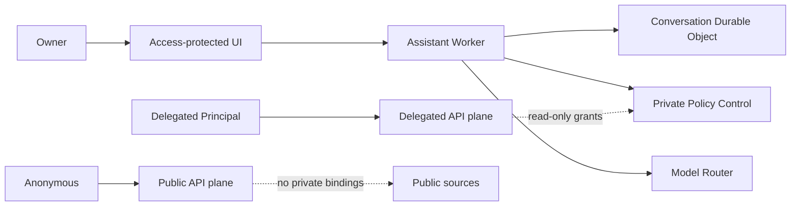

# Open Personal Agent Platform

Cloudflareを常時稼働する制御基盤として使う、本人専用のオープンソース・パーソナルエージェント基盤です。

Each deployment belongs to one owner. External users are isolated as delegated API principals and never become co-users of the owner's personal assistant.

> [!WARNING]
> 現在は`v0.1.0-alpha`です。Phase 2の縦断機能を実装・staging検証した段階であり、本番SLAや長期API互換性は提供していません。

## 現在利用できる機能

- Cloudflare Access JWTを再検証するOwner専用Web UI
- Conversation、Task、Structured Memory、Approval、Audit
- D1、SQLite-backed Durable Objects、Service BindingによるPrivate Control Plane
- OwnerとDelegated Principalを分離するIdentity・ACL
- Information Policy、Capability、Execution Lease、Provenance、Audit Hash Chain
- 非AI資源のReservationと包含量80%の既定Hard Limit
- Workers AIの月5 USD超過予算、AI Gateway、Neuron Reservation
- Mock Local ProviderとWorkers AI Provider
- AI Gateway経由の`@cf/google/gemma-4-26b-a4b-it`
- Public WorkerからPrivate Bindingを排除するCI契約試験
- Cloudflare契約や実資格情報を必要としないContributor CI

Ownerは招待操作や外部承認なしで初回設定を開始します。外部サイト利用者はDelegated Principalとして明示公開された読取Sourceだけを利用します。

## まだ実装していないもの

Google、GitHub、Discord Connector、公開Knowledge API、MCP、生成SDK、動的Sandbox Pluginは後続Phaseです。Gmail送信、GitHubコード変更、決済、複数Owner、複数Tenantはv0.1の対象外です。

## 境界



Public WorkerはControl D1、OAuth Gatekeeper、Owner Memory、Private R2、Local Providerへ到達できません。Ownerデータは送信先が明示許可された場合だけCloud Providerへ送られ、`secret`データはすべてのModel利用を拒否します。

## 開発

必要な環境はNode.js 24とpnpm 10です。

```bash
pnpm install --frozen-lockfile
pnpm check
```

`pnpm check`はlint、strict TypeScript、102件のテスト、Coverage基準、全Workerのdry-run buildを実行します。通常のCIはMockだけを使用し、Cloudflareアカウントや実資格情報を必要としません。

## 配置

標準配置先はCloudflare Workers Paidです。Resource ID、Owner Email、Access Audience、Gateway IDなど配置固有の値は`.wrangler/`配下に生成し、Gitへ追加しません。

現時点のstaging手順と受入項目は[Phase 2 staging検証](docs/operations/phase-2-staging.md)を参照してください。コード変更なしのCloud Base Profileと完全な導入ウィザードはv0.1までに整備します。

## 費用とプライバシー

- 非AI資源はWorkers Paid包含量の60%で警告し、80%で既定停止します。
- Workers AIは日次無料Neuronを先に使い、月5 USDまでの超過を既定で許可します。
- AI GatewayのSpend Limitを二次防壁として使用します。
- Gateway Payload Loggingは無効です。
- AI予算到達後もモデルを使わない検索は継続します。
- 無許可のCloud Providerへ自動Fallbackしません。
- 外部Telemetryは既定無効です。

アプリケーションのHard Limitは、同じCloudflareアカウント内の別Workerやコード実行前に計上される分散攻撃の請求額までは保証しません。詳細は[利用量・費用予算](docs/operations/resource-budgets.md)を参照してください。

## 文書

- [アーキテクチャ](docs/architecture/overview.md)
- [脅威モデル](docs/security/threat-model.md)
- [データ処理方針](docs/security/data-handling.md)
- [Identity設定](docs/operations/identity-configuration.md)
- [Owner操作面](docs/operations/owner-surface.md)
- [Phase 2 staging検証](docs/operations/phase-2-staging.md)

## Security and license

脆弱性は公開IssueではなくGitHub Security Advisoryから報告してください。詳細は[SECURITY.md](SECURITY.md)を参照してください。

Apache License 2.0
